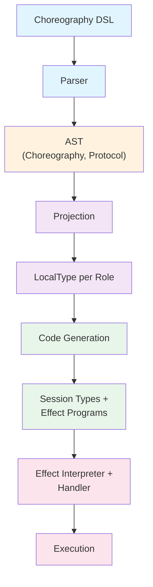

# Architecture

## Overview

Rumpsteak implements choreographic programming for Rust. The system compiles global protocol specifications into local session types for each participant.

The architecture has four main layers:

1. DSL and parsing (choreographic syntax to AST)
2. Projection (global protocol to local types)
3. Code generation (local types to Rust code)
4. Effect system (protocol execution with pluggable transports)

## Component Diagram



## Core Components

### AST Module

Location: `choreography/src/ast/`

The AST represents choreographies as data structures. Main types:

```rust
pub struct Choreography {
    pub name: Ident,
    pub roles: Vec<Role>,
    pub protocol: Protocol,
}
```

Choreography holds the protocol name, participating roles, and the protocol tree.

```rust
pub enum Protocol {
    Send { from: Role, to: Role, message: MessageType, continuation: Box<Protocol> },
    Choice { role: Role, branches: Vec<(Label, Protocol)> },
    Loop { condition: Option<Condition>, body: Box<Protocol> },
    Parallel { protocols: Vec<Protocol> },
    Rec { name: Ident, body: Box<Protocol> },
    End,
}
```

Protocol is a recursive tree structure representing all possible protocol actions.

### Parser Module

Location: `choreography/src/compiler/parser.rs`

The parser converts DSL text into AST using the Pest parser generator. It validates role declarations and builds the protocol tree.

Entry points:

```rust
pub fn parse_choreography_str(input: &str) -> Result<Choreography, ParseError>
pub fn parse_choreography_file(path: &Path) -> Result<Choreography, ParseError>
```

The parser performs syntactic validation and basic semantic checks.

### Projection Module

Location: `choreography/src/compiler/projection.rs`

Projection transforms a global protocol into a local view for each role. The algorithm determines what each participant should do.

Main function:

```rust
pub fn project(choreography: &Choreography, role: &Role) -> Result<LocalType, ProjectionError>
```

Projection handles merging parallel branches and detecting conflicts.

### Code Generation Module

Location: `choreography/src/compiler/codegen.rs`

The codegen module converts local types into Rust session types and effect programs. It generates compile-time type-safe protocol implementations.

Functions:

```rust
pub fn generate_session_types(choreography: &Choreography) -> TokenStream
pub fn generate_effects_protocol(choreography: &Choreography) -> TokenStream
```

The generator creates role structs, message enums, and session type definitions.

### Effect System

Location: `choreography/src/effects/`

The effect system decouples protocol logic from transport. Protocols are represented as effect programs that handlers interpret.

Core trait:

```rust
pub trait ChoreoHandler {
    type Role: RoleId;
    type Endpoint;

    async fn send<M>(&mut self, ep: &mut Self::Endpoint, to: Self::Role, msg: &M) -> Result<()>;
    async fn recv<M>(&mut self, ep: &mut Self::Endpoint, from: Self::Role) -> Result<M>;
    async fn choose(&mut self, ep: &mut Self::Endpoint, who: Self::Role, label: Label) -> Result<()>;
    async fn offer(&mut self, ep: &mut Self::Endpoint, from: Self::Role) -> Result<Label>;
}
```

Handlers implement this trait to provide different execution strategies.

## Data Flow

Input choreography:
```rust
Alice -> Bob: Request
Bob -> Alice: Response
```

After parsing, AST contains:
```rust
Protocol::Send {
    from: Alice, to: Bob, message: Request,
    continuation: Protocol::Send {
        from: Bob, to: Alice, message: Response,
        continuation: Protocol::End
    }
}
```

After projection for Alice:
```rust
LocalType::Send {
    to: Bob, message: Request,
    continuation: LocalType::Receive {
        from: Bob, message: Response,
        continuation: LocalType::End
    }
}
```

After projection for Bob:
```rust
LocalType::Receive {
    from: Alice, message: Request,
    continuation: LocalType::Send {
        to: Alice, message: Response,
        continuation: LocalType::End
    }
}
```

After code generation for Alice:
```rust
type Alice_Protocol = Send<Bob, Request, Receive<Bob, Response, End>>;
```

At runtime, effect programs execute using handlers:
```rust
Program::new()
    .send(Bob, Request)
    .recv::<Response>(Bob)
    .end()
```

## Design Decisions

### Why Choreographic Programming

Creating distributed programs typically requires writing separate implementations for each participant. Choreographies specify the global protocol once and project to local code automatically.

This approach prevents protocol mismatches and simplifies reasoning about distributed systems.

### Why Effect Handlers

Separating protocol logic from transport enables testing, composition, and runtime flexibility. The same protocol can run with different handlers without code changes.

### Why Session Types

Session types provide compile-time guarantees about protocol compliance. The Rust type system enforces that each role follows their protocol correctly.

### Platform Abstraction

The runtime module provides platform-specific async primitives. Native targets use tokio while WASM uses wasm-bindgen-futures. This abstraction makes the core library portable.

## Extension Points

### Custom Handlers

Implement `ChoreoHandler` to add new transport mechanisms. See `05_effect_handlers.md` for details.

### Middleware

Wrap handlers with middleware for cross-cutting concerns like logging, metrics, or retry logic. Middleware composes naturally.

### Custom Projections

The projection algorithm can be extended for domain-specific optimizations. Override default projection rules by implementing custom projection functions.

### Code Generation Backends

Add new code generation backends to target different session type libraries or languages. The AST and LocalType representations are language-agnostic.

## Workspace Organization

Rumpsteak-Aura is organized as a Cargo workspace with multiple crates:

```
rumpsteak-aura/
├── src/                     Core session types library (rumpsteak-aura crate)
│   ├── lib.rs              Session type primitives, channels, roles
│   ├── channel.rs          Async channel implementations
│   └── serialize.rs        Serialization support
├── choreography/            Choreographic programming extensions
│   ├── src/
│   │   ├── ast/            AST definitions
│   │   ├── compiler/       Parser, projection, codegen
│   │   ├── effects/        Effect system
│   │   │   ├── handlers/  Handler implementations
│   │   │   └── middleware/ Middleware implementations
│   │   └── runtime.rs      Platform abstraction
│   ├── tests/              Integration tests
│   └── examples/           Example protocols
├── fsm/                     Finite state machine support
│   └── src/                FSM types and subtyping verification
├── macros/                  Procedural macros
│   └── src/                choreography! and other macros
├── caching/                 HTTP cache case study
│   └── src/                Redis-backed cache example
├── examples/                Additional examples
│   └── wasm-ping-pong/     WASM browser example
└── docs/                    Documentation
```

### Crate Responsibilities

**rumpsteak-aura** (root `src/`): Foundation session types library providing core primitives for type-safe asynchronous communication. This is the base dependency for all other crates.

**rumpsteak-choreography**: High-level choreographic programming layer with DSL parser, automatic projection, effect handlers, and runtime support. Builds on top of rumpsteak-aura.

**rumpsteak-fsm**: Finite state machine support for session types, including DOT parsing and subtyping verification. Optional dependency for advanced use cases.

**rumpsteak-macros**: Procedural macros used by both rumpsteak-aura and rumpsteak-choreography.

**caching**: Example application demonstrating real-world usage with Redis and HTTP caching.

This workspace structure follows standard Rust conventions where the root crate provides core functionality and workspace members extend it with specialized capabilities.
