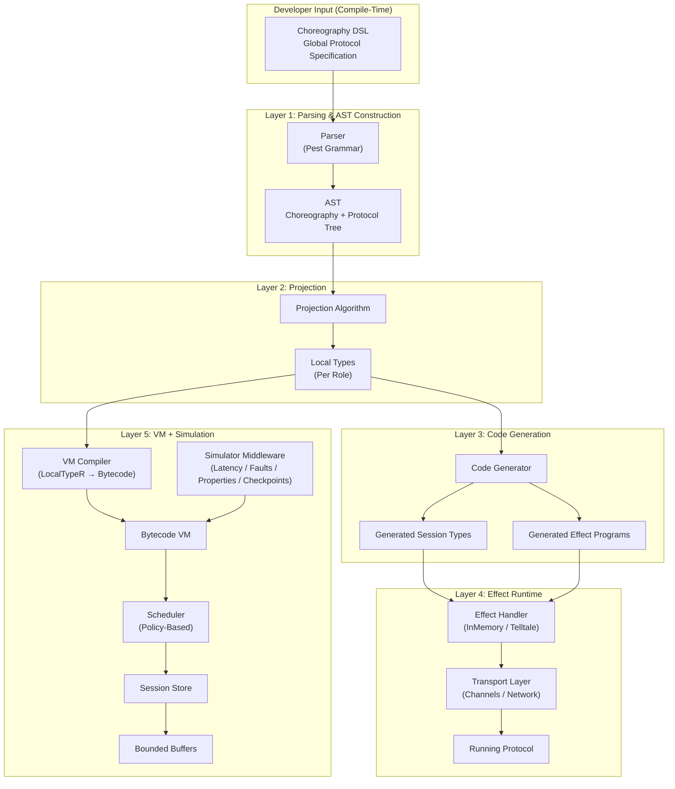

# Architecture

## Overview

Telltale implements choreographic programming for Rust. The system compiles global protocol specifications into local session types for each participant.

The architecture has three compile-time stages and two runtime paths:

1. DSL and parsing (choreographic syntax to AST)
2. Projection (global protocol to local types)
3. Code generation (local types to Rust code and effect programs)
4. Effect handler execution (async interpreter with pluggable transports)
5. VM execution and simulation (bytecode VM with scheduler and deterministic middleware)

## Component Diagram



This diagram summarizes the compile time flow from DSL input to runtime execution. It also highlights the boundary between compilation and effect handler execution.

## Core Components

### AST Module

The AST module is located in `rust/choreography/src/ast/`. It represents choreographies as data structures.

The main type is `Choreography`.

```rust
pub struct Choreography {
    pub name: Ident,
    pub namespace: Option<String>,
    pub roles: Vec<Role>,
    pub protocol: Protocol,
    pub attrs: HashMap<String, String>,
}
```

This struct holds the protocol name and optional namespace. It contains participating roles and the protocol tree. Metadata attributes are stored in the attrs field.

The `Protocol` enum defines all protocol actions.

```rust
pub enum Protocol {
    Send {
        from: Role,
        to: Role,
        message: MessageType,
        continuation: Box<Protocol>,
        annotations: Annotations,
        from_annotations: Annotations,
        to_annotations: Annotations,
    },
    Broadcast {
        from: Role,
        to_all: NonEmptyVec<Role>,
        message: MessageType,
        continuation: Box<Protocol>,
        annotations: Annotations,
        from_annotations: Annotations,
    },
    Choice {
        role: Role,
        branches: NonEmptyVec<Branch>,
        annotations: Annotations,
    },
    Loop { condition: Option<Condition>, body: Box<Protocol> },
    Parallel { protocols: NonEmptyVec<Protocol> },
    Rec { label: Ident, body: Box<Protocol> },
    Var(Ident),
    Extension {
        extension: Box<dyn ProtocolExtension>,
        continuation: Box<Protocol>,
        annotations: Annotations,
    },
    End,
}
```

Protocol is a recursive tree structure. It includes support for annotations at multiple levels. Broadcasts, choices, parallel composition, and recursive definitions are supported. `NonEmptyVec` is used where the DSL enforces at least one branch.

### Parser Module

The parser module is located in `rust/choreography/src/compiler/parser/`. It converts DSL text into AST using the Pest parser generator.

The parser validates role declarations. It builds the protocol tree from the input text.
It runs a layout preprocessor before the grammar parse. This enables layout sensitive syntax with explicit braces for empty blocks.

Two entry points are available.

```rust
pub fn parse_choreography_str(input: &str) -> Result<Choreography, ParseError>
pub fn parse_choreography_file(path: &Path) -> Result<Choreography, ParseError>
```

The parser performs syntactic validation and basic semantic checks.

### Projection Module

The projection module is located in `rust/choreography/src/compiler/projection.rs`. Projection transforms a global protocol into a local view for each role.

The algorithm determines what each participant should do.

```rust
pub fn project(choreography: &Choreography, role: &Role) -> Result<LocalType, ProjectionError>
```

Projection handles merging parallel branches. It also detects conflicts between branches.

### Code Generation Module

The codegen module is located in `rust/choreography/src/compiler/codegen/`. It converts local types into Rust session types and effect programs.

The generator creates compile-time type-safe protocol implementations.

```rust
pub fn generate_session_type(role: &Role, local_type: &LocalType, protocol_name: &str) -> TokenStream
pub fn generate_choreography_code(name: &str, roles: &[Role], local_types: &[(Role, LocalType)]) -> TokenStream
pub fn generate_choreography_code_with_extensions(
    choreography: &Choreography,
    local_types: &[(Role, LocalType)],
    extensions: &[Box<dyn ProtocolExtension>],
) -> TokenStream
pub fn generate_choreography_code_with_dynamic_roles(
    choreography: &Choreography,
    local_types: &[(Role, LocalType)],
) -> TokenStream
pub fn generate_choreography_code_with_namespacing(
    choreography: &Choreography,
    local_types: &[(Role, LocalType)],
) -> TokenStream
pub fn generate_choreography_code_with_annotations(
    choreography: &Choreography,
    local_types: &[(Role, LocalType)],
) -> TokenStream
pub fn generate_choreography_code_with_topology(choreography: &Choreography, local_types: &[(Role, LocalType)]) -> TokenStream
pub fn generate_dynamic_role_support(choreography: &Choreography) -> TokenStream
pub fn generate_role_implementations(roles: &[Role]) -> TokenStream
pub fn generate_topology_integration(choreography: &Choreography) -> TokenStream
pub fn generate_helpers(name: &str, messages: &[MessageType]) -> TokenStream
```

The generator creates session types and role structs. It supports dynamic roles including parameterized roles and runtime management.

### Effect System

The effect system is located in `rust/choreography/src/effects/`. It decouples protocol logic from transport.

Protocols are represented as effect programs. Handlers interpret these programs.

```rust
pub trait ChoreoHandler: Send {
    type Role: RoleId;
    type Endpoint: Endpoint;

    async fn send<M: Serialize + Send + Sync>(
        &mut self, ep: &mut Self::Endpoint, to: Self::Role, msg: &M
    ) -> ChoreoResult<()>;
    async fn recv<M: DeserializeOwned + Send>(
        &mut self, ep: &mut Self::Endpoint, from: Self::Role
    ) -> ChoreoResult<M>;
    async fn choose(
        &mut self, ep: &mut Self::Endpoint, to: Self::Role, label: <Self::Role as RoleId>::Label
    ) -> ChoreoResult<()>;
    async fn offer(
        &mut self, ep: &mut Self::Endpoint, from: Self::Role
    ) -> ChoreoResult<<Self::Role as RoleId>::Label>;

    async fn with_timeout<F, T>(
        &mut self, ep: &mut Self::Endpoint, at: Self::Role, dur: Duration, body: F
    ) -> ChoreoResult<T>
    where
        F: Future<Output = ChoreoResult<T>> + Send;
}
```

Handlers implement this trait to provide different execution strategies. This async handler is distinct from the synchronous `telltale_vm::effect::EffectHandler` used by the VM.

### VM Execution Layer

The VM provides a bytecode execution model for local types. The `telltale-vm` crate compiles `LocalTypeR` into bytecode and executes it with a policy-based scheduler. `telltale-simulator` wraps the VM with deterministic middleware for latency, faults, property monitoring, and checkpointing.

The VM maintains session state with bounded message buffers. Each coroutine references its assigned program by ID. The scheduler policies are observationally equivalent per the Lean model. Nested VMs can be hosted inside a coroutine for hierarchical simulation.

See [VM Architecture](11_vm_architecture.md) for details on the bytecode VM architecture.

## Data Flow

This section demonstrates the transformation of a choreography through each layer.

Input choreography:
```rust
Alice -> Bob: Request
Bob -> Alice: Response
```

The choreography specifies a request-response pattern.

After parsing, the AST contains a nested send structure.

```rust
Protocol::Send {
    from: Alice, to: Bob, message: Request,
    continuation: Protocol::Send {
        from: Bob, to: Alice, message: Response,
        continuation: Protocol::End
    }
}
```

This represents the global protocol tree.

After projection for Alice, the local type shows send then receive.

```rust
LocalType::Send {
    to: Bob, message: Request,
    continuation: LocalType::Receive {
        from: Bob, message: Response,
        continuation: LocalType::End
    }
}
```

Alice sends a request and waits for a response.

After projection for Bob, the local type shows receive then send.

```rust
LocalType::Receive {
    from: Alice, message: Request,
    continuation: LocalType::Send {
        to: Alice, message: Response,
        continuation: LocalType::End
    }
}
```

Bob waits for a request and sends a response.

After code generation for Alice, a session type is created.

```rust
type Alice_Protocol = Send<Bob, Request, Receive<Bob, Response, End>>;
```

This session type enforces the protocol at compile time.

At runtime, effect programs execute using handlers.

```rust
Program::new()
    .send(Bob, Request)
    .recv::<Response>(Bob)
    .end()
```

The handler interprets this program into actual communication.

## Design Decisions

### Why Choreographic Programming

Creating distributed programs typically requires writing separate implementations for each participant. This approach is error-prone and hard to verify.

Choreographies specify the global protocol once. Automatic projection generates local code for each role. This approach prevents protocol mismatches and simplifies reasoning about distributed systems.

### Why Effect Handlers

Separating protocol logic from transport enables testing and composition. The same protocol can run with different handlers without code changes.

Effect handlers provide runtime flexibility. Test handlers use in-memory communication. Production handlers use network transports.

### Why Session Types

Session types provide compile-time guarantees about protocol compliance. The Rust type system enforces that each role follows their protocol correctly.

Type checking prevents common distributed systems errors. Deadlocks and protocol violations are caught at compile time.

### Platform Abstraction

The runtime module provides platform-specific async primitives. Native targets use tokio. WASM uses wasm-bindgen-futures.

This abstraction makes the core library portable. The same code runs on servers and in browsers.

## Extension Points

### Custom Handlers

Implement `ChoreoHandler` to add new transport mechanisms. See [Effect Handlers](08_effect_handlers.md) for details.

### Middleware

Wrap handlers with middleware for cross-cutting concerns. Logging, metrics, and retry logic can be added as middleware. Middleware composes naturally.

### Custom Projections

The projection algorithm can be extended for domain-specific optimizations. Override default projection rules by implementing custom projection functions.

### Code Generation Backends

Add new code generation backends to target different session type libraries. The AST and LocalType representations are language-agnostic. Backends for other languages can be added.

## Workspace Organization

Telltale is organized as a Cargo workspace with multiple crates. All Rust code is located in the `rust/` directory. The crate structure mirrors the Lean formalization.

```
telltale/
├── rust/                   All Rust crates
│   ├── src/                Facade crate (telltale)
│   ├── types/              Core types (telltale-types)
│   │   └── src/
│   │       ├── global.rs   GlobalType (matches Lean)
│   │       ├── local.rs    LocalTypeR (matches Lean)
│   │       ├── label.rs    Label, PayloadSort
│   │       └── action.rs   Action, LocalAction
│   ├── theory/             Session type algorithms (telltale-theory)
│   │   └── src/
│   │       ├── projection.rs   Global to local projection
│   │       ├── merge.rs        Branch merging
│   │       ├── subtyping/      Sync and async subtyping
│   │       ├── duality.rs      Dual type computation
│   │       └── bounded.rs      Bounded recursion
│   ├── choreography/       DSL and effects (telltale-choreography)
│   │   └── src/
│   │       ├── ast/        Extended AST definitions
│   │       ├── compiler/   Parser, projection, codegen
│   │       ├── effects/    Effect handlers and middleware
│   │       └── runtime/    Platform abstraction
│   ├── lean-bridge/        Lean validation (telltale-lean-bridge)
│   │   └── src/
│   │       ├── export.rs   Rust to JSON export
│   │       ├── import.rs   JSON to Rust import
│   │       └── runner.rs   Lean binary invocation
│   ├── vm/                 Bytecode VM engine (telltale-vm)
│   ├── simulator/          Deterministic simulation (telltale-simulator)
│   ├── transport/          Production transports (telltale-transport)
│   └── macros/             Procedural macros (telltale-macros)
├── lean/                   Lean 4 verification code
├── examples/               Example protocols
└── docs/                   Documentation
```

This tree outlines the workspace layout and crate locations. It helps map each crate name to its directory.

### Crate Responsibilities

The `telltale-types` crate contains core type definitions (`GlobalType`, `LocalTypeR`, `Label`, `PayloadSort`) that match Lean exactly. The `telltale-theory` crate contains pure algorithms for projection, merge, duality, subtyping, and well-formedness checks. This crate depends only on `telltale-types`.

The `telltale-choreography` crate is the choreographic programming layer including the DSL parser, effect handlers, code generation, and runtime support. The `telltale-lean-bridge` crate provides Lean integration through JSON export and import with a runner for invoking the verification binary.

The `telltale-vm` crate provides the bytecode VM, scheduler, and compiler for `LocalTypeR`. The `telltale-simulator` crate wraps the VM with deterministic middleware for latency, faults, property monitoring, and checkpointing.

The `telltale` crate is the main facade that re-exports types from other crates with feature flags. Most users import from this crate.
