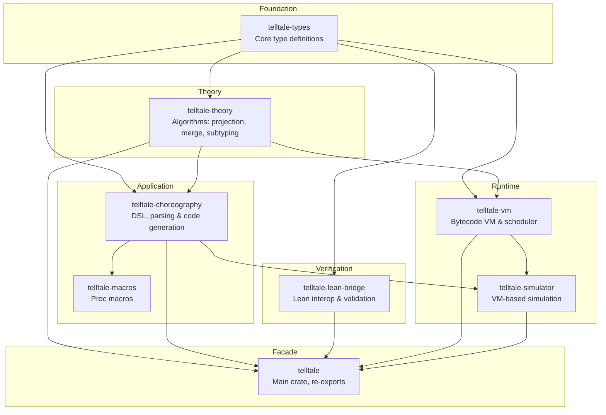

# Crate Organization

This document describes the crate architecture introduced in v0.7.0. The structure aligns with Lean verification and provides clear separation of concerns.

## Crate Dependency Graph



This diagram shows the dependency relationships between crates. Arrows indicate dependency direction. The `telltale-types` crate serves as the foundation for all other crates.

## Crate Descriptions

### telltale-types

This crate is located in `rust/types/`. It contains all core type definitions that match Lean exactly. It has no dependencies on other workspace crates.

The crate defines `GlobalType` for global protocol views. It defines `LocalTypeR` for local participant views. It also defines `Label` for message labels with payload sorts, `PayloadSort` for type classification, and `Action` for send and receive actions.

The crate also provides content addressing infrastructure. The `ContentId` type wraps a cryptographic hash. The `Contentable` trait defines canonical serialization. The `Hasher` trait abstracts hash algorithms.

**Feature flags:**

- `dag-cbor` — Enables DAG-CBOR serialization for IPLD/IPFS compatibility. Adds `to_cbor_bytes()`, `from_cbor_bytes()`, and `content_id_cbor_sha256()` methods to `Contentable` types.

```rust
use telltale_types::{GlobalType, LocalTypeR, Label, PayloadSort};

let g = GlobalType::comm(
    "Client",
    "Server",
    vec![(Label::new("request"), GlobalType::End)],
);

let lt = LocalTypeR::send("Server", Label::new("request"), LocalTypeR::End);
```

The first expression creates a global type matching Lean's `GlobalType.comm "Client" "Server" [...]` constructor. The second creates a local type matching Lean's `LocalTypeR.send "Server" [...]` constructor.

### telltale-theory

This crate is located in `rust/theory/`. It implements pure algorithms for session type operations. The crate performs no IO or parsing.

The `projection` module handles `GlobalType` to `LocalTypeR` projection with merging. The `merge` module implements branch merging with distinct semantics for send and receive. Send merge requires identical label sets while receive merge unions labels. This matches Lean's `mergeSendSorted` and `mergeRecvSorted` functions.

The `subtyping/sync` module provides synchronous subtyping. The `subtyping/async` module provides asynchronous subtyping via SISO decomposition. The `well_formedness` module contains validation predicates. The `duality` module computes dual types. The `bounded` module implements bounded recursion strategies.

The `content_id` module provides content addressing for all types. Projection results are memoized by content ID for performance. See [Content Addressing](21_content_addressing.md) for details.

```rust
use telltale_theory::{project, merge, sync_subtype, async_subtype};
use telltale_types::GlobalType;

let global = GlobalType::comm("A", "B", vec![...]);
let local_a = project(&global, "A")?;
let local_b = project(&global, "B")?;

assert!(sync_subtype(&local_a, &local_a_expected));
```

The `project` function computes the local type for a given role. The `sync_subtype` function checks synchronous subtyping between local types.

### telltale-lean-bridge

This crate is located in `rust/lean-bridge/`. It provides bidirectional conversion between Rust types and Lean-compatible JSON. See [Lean-Rust Bridge](20_lean_rust_bridge.md) for detailed documentation.

The `export` module converts Rust types to JSON for Lean. The `import` module converts Lean JSON back to Rust types. The `validate` module provides cross-validation between Rust and Lean.

The `lean-bridge` CLI tool is available with the `cli` feature.

```bash
lean-bridge sample --sample ping-pong --pretty
lean-bridge validate --input protocol.json --type global
lean-bridge import --input protocol.json
```

These commands generate samples, validate round-trips, and import JSON respectively.

### telltale-vm

This crate is located in `rust/vm/`. It provides a bytecode VM for executing session type protocols. The VM offers an alternative execution model to direct effect handler interpretation.

The `instr` module defines the bytecode instruction set. Instructions include `Send`, `Recv`, `Offer`, `Choose` for communication. Instructions include `Open`, `Close` for session lifecycle. The `Invoke` instruction calls effect handlers. Control flow uses `Jmp`, `Yield`, and `Halt`.

The `coroutine` module defines lightweight execution units. Each coroutine has a program counter, register file, and status. Each coroutine has a `programId` that references its assigned program in the VM. The `scheduler` module implements scheduling policies. Available policies are `Cooperative`, `RoundRobin`, and `ProgressAware`.

The `session` module manages session state and type advancement. The `buffer` module provides bounded message buffers. Buffer modes include `FIFO` and `LatestValue`. Backpressure policies include `Block`, `Drop`, `Error`, and `Resize`.

The `loader` module handles dynamic choreography loading. The `CodeImage` struct packages local types for loading. The `load_choreography` method creates sessions and coroutines from a code image.

```rust
use telltale_vm::{VM, VMConfig, CodeImage};

let mut vm = VM::new(VMConfig::default());
let image = CodeImage::from_local_types(&local_types, &global_type);
let sid = vm.load_choreography(&image)?;
vm.run(&handler, 1000)?;
```

The first line creates a VM with default configuration. The second line creates a code image from local types. The third line loads the choreography and returns a session ID. The fourth line runs the VM with an effect handler.

### telltale-simulator

This crate is located in `rust/simulator/`. It wraps the VM for simulation and testing. The crate depends on `telltale-vm` and `telltale-choreography`.

The `vm_runner` module provides the `run_vm` function for single-choreography execution. It also provides `run_vm_concurrent` for multiple choreographies. The `VmEffectAdapter` bridges simulator effect handlers to VM effect handlers.

The `ChoreographySpec` struct packages a choreography for simulation. It includes local types, global type, and initial state. The `Trace` type collects step records during execution.

```rust
use telltale_simulator::{run_vm, ChoreographySpec};

let spec = ChoreographySpec {
    local_types: types,
    global_type: global,
    initial_states: states,
};
let trace = run_vm(&spec.local_types, &spec.global_type, &spec.initial_states, 100, &handler)?;
```

The `run_vm` function executes a choreography and returns a trace. The trace contains step records for each role at each step.

### telltale-choreography

This crate is located in `rust/choreography/`. It provides DSL and parsing for choreographic programming. It depends on `telltale-types` and `telltale-theory`.

The `ast/` directory contains extended AST types including `Protocol`, `LocalType`, and `Role`. The `compiler/parser` module handles DSL parsing. The `compiler/projection` module handles choreography to `LocalType` projection. The `compiler/codegen` module handles Rust code generation. The `effects/` directory contains the effect system and handlers. The `extensions/` directory contains the DSL extension system. The `runtime/` directory contains platform abstraction.

The `topology/` directory provides deployment configuration. See [Topology](14_topology.md) for the separation between protocol logic and deployment. The `heap/` directory provides explicit resource management. See [Resource Heap](22_resource_heap.md) for nullifier-based consumption tracking.

### telltale

This crate is located in `rust/src/`. It is the main facade crate that re-exports from all other crates.

The crate supports several feature flags. The `theory` feature includes `telltale-theory` algorithms. The `full` feature enables all optional features. See [Getting Started](01_getting_started.md) for the complete feature flag reference.

```rust
use telltale::prelude::*;
```

The prelude provides access to types, theory algorithms, and other commonly used items.

## Data Flow

```
DSL Text                 Choreography AST               GlobalType
-----------► Parser -------------------► Lower -------------------►
 "A -> B"                    (DSL)                    (telltale-types)

                                |
                                | project()
                                v

                            LocalTypeR
                         (telltale-types)
                                |
                +---------------+---------------+---------------+
                |               |                               |
                v               v                               v
          Session Types     CodeImage                         JSON
          & Effect Programs  (vm)                            (Lean)
          (choreography)        |                         (lean-bridge)
                |               |                               |
                v               v                               v
           Effect Handler   VM Execution                      Lean
           Interpretation   (scheduler,                    Validation
                            coroutines)
```

The flow begins with DSL text parsed into a choreography AST. The AST is lowered to `GlobalType`. Projection computes `LocalTypeR` for each role.

From local types, three paths are available. Code generation produces session types and effect programs for handler interpretation. The VM path compiles local types to bytecode for VM execution. The Lean path exports JSON for formal validation.

## Lean Correspondence

The types crate mirrors Lean definitions exactly. The following table shows the correspondence.

| Lean Type | Rust Type | File |
|-----------|-----------|------|
| `GlobalType.end` | `GlobalType::End` | `rust/types/src/global.rs` |
| `GlobalType.comm p q bs` | `GlobalType::Comm { sender, receiver, branches }` | `rust/types/src/global.rs` |
| `GlobalType.rec t G` | `GlobalType::Mu { var, body }` | `rust/types/src/global.rs` |
| `GlobalType.var t` | `GlobalType::Var(String)` | `rust/types/src/global.rs` |
| `LocalTypeR.end` | `LocalTypeR::End` | `rust/types/src/local.rs` |
| `LocalTypeR.send q bs` | `LocalTypeR::Send { partner, branches }` | `rust/types/src/local.rs` |
| `LocalTypeR.recv p bs` | `LocalTypeR::Recv { partner, branches }` | `rust/types/src/local.rs` |
| `LocalTypeR.rec t T` | `LocalTypeR::Mu { var, body }` | `rust/types/src/local.rs` |
| `LocalTypeR.var t` | `LocalTypeR::Var(String)` | `rust/types/src/local.rs` |
| `PayloadSort.unit` | `PayloadSort::Unit` | `rust/types/src/global.rs` |
| `Label` | `Label { name, sort }` | `rust/types/src/global.rs` |

The Rust variant names match Lean constructor names. Field names are consistent across both implementations.

## Extension Points

The architecture supports extension at several points.

### Adding New Code Generation Targets

Implement generators in `rust/choreography/src/compiler/codegen/` that work with the choreography AST or `LocalType`.

```rust
pub fn generate_my_target(lt: &LocalType) -> MyOutput {
    // implementation
}
```

The function receives a local type and produces output in the target format. Follow existing generators as examples.

### Custom Projection Strategies

Extend projection in `rust/theory/src/projection.rs`.

```rust
pub fn project_with_strategy(
    global: &GlobalType,
    role: &str,
    strategy: ProjectionStrategy,
) -> Result<LocalTypeR, ProjectionError> {
    // implementation
}
```

The strategy parameter controls projection behavior. This enables alternative projection algorithms.

### Lean Integration Extensions

Extend the lean-bridge for custom validation.

```rust
impl Validator {
    pub fn my_custom_validation(
        &self,
        rust_type: &LocalTypeR,
        lean_result: &Value,
    ) -> ValidationResult {
        // implementation
    }
}
```

Custom validation methods can implement domain-specific comparison rules. See [Lean-Rust Bridge](20_lean_rust_bridge.md) for more details.
