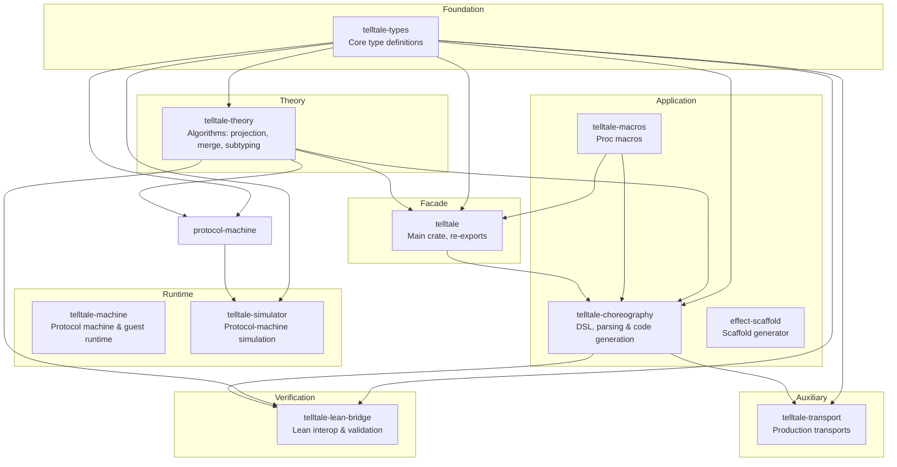

# Code Organization

This document describes the implementation organization of the codebase. It covers workspace layout, crate dependency structure, crate-level responsibilities, and Rust-Lean constructor correspondence.

For conceptual pipeline and runtime architecture, see [Architecture](03_architecture.md).

## Workspace Layout

Telltale is organized as a Cargo workspace rooted at `Cargo.toml`, with the facade package declared at the repository root and additional crates under `rust/`. Lean formalization lives in `lean/` and documentation in `docs/`.

```
telltale/
├── Cargo.toml              Workspace + root package (telltale)
├── rust/
│   ├── src/                Root package source (`telltale` lib path)
│   ├── types/              Core protocol types (telltale-types)
│   ├── theory/             Session type algorithms (telltale-theory)
│   ├── choreography/       DSL, projection glue, and effect runtime
│   ├── lean-bridge/        Lean export/import/validation
│   ├── protocol-machine/                 Protocol machine and guest runtime
│   ├── simulator/          Protocol-machine-backed simulation
│   ├── effect-scaffold/    Internal scaffolding tool
│   ├── macros/             Procedural macros
│   └── transport/          Production transports (workspace member)
├── lean/                   Lean 4 formalization
├── docs/                   mdBook documentation
└── examples/               Example protocols
```

This layout shows where each major subsystem lives. You can navigate from interface docs to implementation files without jumping across unrelated directories.

## Crate Dependency Graph



This diagram shows direct crate dependencies. Arrows point from dependency to dependent crate. Some edges are feature-gated. For example, `telltale-theory` and `telltale-choreography` support in `telltale-lean-bridge` requires explicit feature flags.

## Crate Descriptions

### telltale-types

This crate is located in `rust/types/`. It contains core type definitions shared with Lean for global and local protocol representations. Lean includes a `delegate` constructor that is not yet exposed in Rust. The crate has no dependencies on other workspace crates.

The crate defines `GlobalType` for global protocol views. It defines `LocalTypeR` for local participant views. It also defines `Label` for message labels with payload sorts, `PayloadSort` for type classification, and `Action` for send and receive actions.

The crate provides content addressing infrastructure. The `ContentId` type wraps a cryptographic hash. The `Contentable` trait defines canonical serialization. The `Hasher` trait abstracts hash algorithms.

#### Feature Flags

The `dag-cbor` feature enables DAG-CBOR serialization for IPLD or IPFS compatibility. It adds `to_cbor_bytes()`, `from_cbor_bytes()`, and `content_id_cbor_sha256()` methods to `Contentable` types.

```rust
use telltale_types::{GlobalType, LocalTypeR, Label, PayloadSort};

let g = GlobalType::comm(
    "Client",
    "Server",
    vec![(Label::new("request"), GlobalType::End)],
);

let lt = LocalTypeR::send("Server", Label::new("request"), LocalTypeR::End);
```

The first expression creates a global type matching Lean's `GlobalType.comm "Client" "Server" [...]` constructor. The second creates a local type matching Lean's `LocalTypeR.send "Server" [...]` constructor.

### telltale-theory

This crate is located in `rust/theory/`. It implements pure algorithms for session type operations. The crate performs no IO or parsing.

#### Modules

The `projection` module handles `GlobalType` to `LocalTypeR` projection with merging. The `merge` module implements branch merging where send merge requires identical label sets and receive merge unions labels. This matches Lean's `mergeBranchesSend` and `mergeBranchesRecv` functions.

The `subtyping/sync` module provides synchronous subtyping. The `subtyping/async` module provides asynchronous subtyping via SISO decomposition. The `well_formedness` module contains validation predicates. The `duality` module computes dual types and the `bounded` module implements bounded recursion strategies.

Projection memoization uses the content store in `telltale-types` to cache by content ID. See [Content Addressing](20_content_addressing.md) for details.

```rust
use telltale_theory::{project, merge, sync_subtype, async_subtype};
use telltale_types::GlobalType;

let global = GlobalType::comm("A", "B", vec![...]);
let local_a = project(&global, "A")?;
let local_b = project(&global, "B")?;

assert!(sync_subtype(&local_a, &local_a_expected));
```

The `project` function computes the local type for a given role. The `sync_subtype` function checks synchronous subtyping between local types.

### telltale-lean-bridge

This crate is located in `rust/lean-bridge/`. It provides bidirectional conversion between Rust types and Lean-compatible JSON. See [Lean-Rust Bridge](24_lean_rust_bridge.md) for detailed documentation.

The `export` module converts Rust types to JSON for Lean. The `import` module converts Lean JSON back to Rust types. The `validate` module provides cross-validation between Rust and Lean.

The `lean-bridge` CLI tool is available with the `cli` feature.

```bash
lean-bridge sample --sample ping-pong --pretty
lean-bridge validate --input protocol.json --type global
lean-bridge import --input protocol.json
```

These commands generate samples, validate round-trips, and import JSON respectively.

### telltale-machine

This crate is located in `rust/machine/`. It provides the protocol machine and guest-runtime surfaces for executing session type protocols. The protocol machine is the canonical semantic core used by the simulator and by direct embeddings.

The canonical public entry modules are `telltale_machine::protocol_machine`,
`telltale_machine::guest_runtime`, and `telltale_machine::host_runtime`. The historical
`engine` and `threaded` modules still exist as implementation modules, but they are
not the architectural front door.

#### Instruction Set and Modules

The `instr` module defines the bytecode instruction set. Communication instructions include `Send`, `Receive`, `Offer`, and `Choose`. Session lifecycle uses `Open` and `Close`.

Effect and guard execution uses `Invoke`, `Acquire`, and `Release`. Speculation and ownership support uses `Fork`, `Join`, `Abort`, `Transfer`, `Tag`, and `Check`. Control flow uses `Set`, `Move`, `Jump`, `Spawn`, `Yield`, and `Halt`.

The `coroutine` module defines lightweight execution units. Each coroutine has a program counter, register file, and status. Each coroutine stores its session ID, role, and bytecode program.

#### Scheduling, Sessions, and Loading

The `scheduler` module implements scheduling policies. Available policies are `Cooperative`, `RoundRobin`, `Priority`, and `ProgressAware`.

The `session` module manages session state and type advancement. The `buffer` module provides bounded message buffers. Buffer modes include `Fifo` and `LatestValue`. Backpressure policies include `Block`, `Drop`, `Error`, and `Resize`.

The `loader` module handles dynamic choreography loading. The `CodeImage` struct packages local types for loading. The preferred host-facing open path is `load_choreography_owned(...)`, which binds explicit guest-runtime ownership at open.

```rust
use telltale_machine::{GuestRuntime, OwnedSession, ProtocolMachine, ProtocolMachineConfig};
use telltale_machine::loader::CodeImage;

let mut machine = ProtocolMachine::new(ProtocolMachineConfig::default());
let image = CodeImage::from_local_types(&local_types, &global_type);
let _session: OwnedSession =
    machine.load_choreography_owned(&image, "runtime/owner")?;
let _status = machine.run(&handler, 1000)?;

let mut guest = GuestRuntime::new(ProtocolMachineConfig::default());
let _owned = guest.load_choreography_owned(&image, "runtime/owner")?;
```

The first line creates a protocol machine with default configuration. The second line creates a code image from local types. The third line opens the choreography and binds the current host owner. The fourth line runs the protocol machine to completion with an external handler and step limit.

The final two lines show the higher-level guest-runtime surface that wraps the protocol machine for host integration.

### telltale-simulator

This crate is located in `rust/simulator/`. It wraps the protocol machine and guest-runtime surfaces for simulation and testing. The crate depends on `telltale-machine` and `telltale-types`.

The `runner` module provides `run`, `run_concurrent`, and `run_with_scenario` for single or multi choreography execution. Scenario runs attach middleware for faults, network latency, property monitors, and checkpoints.

The `ChoreographySpec` struct packages a choreography for simulation. It includes local types, global type, and initial state vectors. The `Trace` type collects step records during execution.

#### Harness and Material Handlers

The `harness` module adds integration APIs for third-party projects. It exports `HostAdapter`, `DirectAdapter`, `MaterialAdapter`, `HarnessSpec`, `HarnessConfig`, and `SimulationHarness`. The `contracts` module exports reusable post-run checks for replay coherence and expected role coverage.

Material-model handlers are grouped in `rust/simulator/src/material_handlers/`. The crate re-exports `IsingHandler`, `HamiltonianHandler`, `ContinuumFieldHandler`, and `handler_from_material` from this module.

```rust
use telltale_simulator::runner::{run, ChoreographySpec};

let spec = ChoreographySpec {
    local_types: types,
    global_type: global,
    initial_states: states,
};
let trace = run(&spec.local_types, &spec.global_type, &spec.initial_states, 100, &handler)?;
```

The `run` function executes a choreography and returns a trace. The trace contains step records for each role at each step. The simulator crate also ships a CLI entrypoint in `rust/simulator/src/bin/run.rs`.

### telltale-choreography

This crate is located in `rust/choreography/`. It provides DSL and parsing for choreographic programming. It depends on `telltale`, `telltale-macros`, `telltale-types`, and `telltale-theory`.

The `ast/` directory contains extended AST types including `Protocol`, `LocalType`, and `Role`. The `compiler/parser` module handles DSL parsing. The `compiler/projection` module handles choreography to `LocalType` projection. The `compiler/codegen` module handles Rust code generation.

#### Parser Features

The parser supports proof-bundle declarations with enriched fields (`version`, `issuer`, `constraint`). Parsed bundles are stored as typed metadata on `Choreography` through `ProofBundleDecl`. Capability inference can auto-select required bundles when protocol `requires` is omitted.

Protocol-machine-core statements such as `acquire`, `transfer`, `fork`, and `check` lower to `Protocol::Extension` nodes. Annotations record operation kind, operands, and required capability. A linear usage checker rejects double-consume, consume-before-acquire, and branch divergence for delegation assets.

First-class combinators (`handshake`, `retry`, `quorum_collect`) and typed metadata for role-set and topology declarations (`role_set`, `cluster`, `ring`, `mesh`) are supported. Lowering diagnostics are exposed through `explain_lowering` and `choreo-fmt --explain-lowering`.

#### Validation and Submodules

Validation includes bundle and capability checks. It rejects duplicate bundle declarations, missing required bundles, and missing capability coverage for protocol machine-core statements. See [Choreographic DSL](06_choreographic_dsl.md) for syntax details.

The `effects/` directory contains the effect system and handlers. The `extensions/` directory contains the DSL extension system. The `runtime/` directory contains platform abstraction.

The `topology/` directory provides deployment configuration. See [Topology](22_topology.md) for the separation between protocol logic and deployment. The `heap/` directory provides explicit resource management. See [Resource Heap](21_resource_heap.md) for nullifier-based consumption tracking.

### telltale-macros

This crate is located in `rust/macros/`. It provides procedural macros for deriving session type constructs. The crate exports `choreography!`, `session`, `Role`, `Roles`, and `Message` macros.

The `choreography!` macro parses inline DSL text and generates role types, message types, and session types at compile time. The `Role` and `Roles` derive macros generate `RoleId` trait implementations. The `Message` derive macro generates `Serialize` and `Deserialize` bindings for protocol messages.

### effect-scaffold

This crate is located in `rust/effect-scaffold/`. It is an internal helper tool that reads Telltale `effect` declarations and generates:

- canonical Rust request/outcome enums
- host-runtime handler traits
- first-class simulator traits and scenario builders
- an exported effect-family manifest

The package is marked `publish = false` and is intended for repository workflows rather than library consumers. It no longer maintains a separate hand-authored scaffold vocabulary. The DSL effect surface is the single source of truth.

### telltale-transport

This crate is located in `rust/transport/`. It provides production transport implementations for session types. The crate depends on `telltale-choreography` and `telltale-types` and is part of the workspace member list in the root `Cargo.toml`.

The crate implements TCP-based transports with async networking via tokio. Future features include TLS support. The transport layer integrates with the effect handler system from `telltale-choreography`.

### telltale (root crate)

This crate is defined at the repository root and uses `rust/src/` as its library source path. It re-exports core APIs from `telltale-types`, `telltale-macros`, and optional `telltale-theory` features.

The crate supports several feature flags. The `theory` feature enables `telltale-theory` algorithms. The `full` feature enables all optional root features. See [Getting Started](02_getting_started.md) for the complete feature flag reference.

```rust
use telltale::prelude::*;
```

The prelude provides access to types, theory algorithms, and other commonly used items.

## Lean Correspondence

The shared constructor set is aligned between `telltale-types` and Lean for core protocol terms. The table below shows the correspondence for constructors that are present in both implementations.

| Lean Type | Rust Type | File |
|-----------|-----------|------|
| `GlobalType.end` | `GlobalType::End` | `rust/types/src/global.rs` |
| `GlobalType.comm p q bs` | `GlobalType::Comm { sender, receiver, branches }` | `rust/types/src/global.rs` |
| `GlobalType.mu t G` | `GlobalType::Mu { var, body }` | `rust/types/src/global.rs` |
| `GlobalType.var t` | `GlobalType::Var(String)` | `rust/types/src/global.rs` |
| `LocalTypeR.end` | `LocalTypeR::End` | `rust/types/src/local.rs` |
| `LocalTypeR.send q bs` | `LocalTypeR::Send { partner, branches }` | `rust/types/src/local.rs` |
| `LocalTypeR.recv p bs` | `LocalTypeR::Recv { partner, branches }` | `rust/types/src/local.rs` |
| `LocalTypeR.mu t T` | `LocalTypeR::Mu { var, body }` | `rust/types/src/local.rs` |
| `LocalTypeR.var t` | `LocalTypeR::Var(String)` | `rust/types/src/local.rs` |
| `PayloadSort.unit` | `PayloadSort::Unit` | `rust/types/src/global.rs` |
| `Label` | `Label { name, sort }` | `rust/types/src/label.rs` |

The Rust variant names match Lean constructor names. Field names are consistent across both implementations.

Rust `LocalTypeR` branches also carry `Option<ValType>` payload annotations. Lean tracks payload sorts at the label level in `GlobalType`.

Lean `GlobalType` includes a `delegate` constructor for channel delegation that is not yet present in Rust. This is tracked as a known parity gap.
