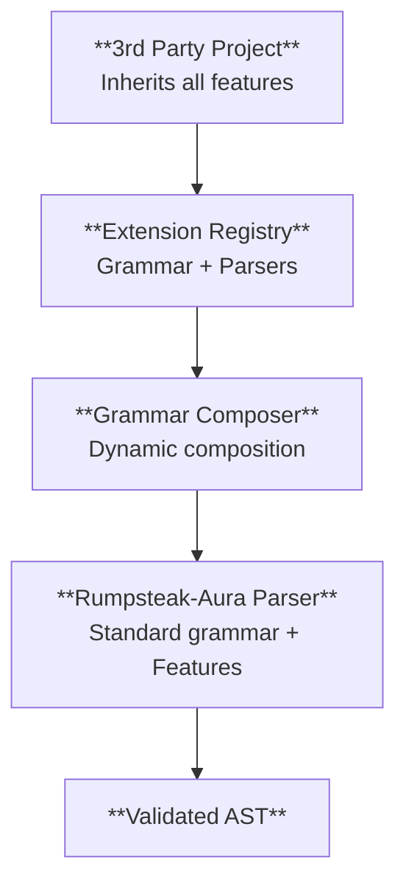

# Syntax Extensions in Rumpsteak-Aura

This guide covers the complete syntax extension system in rumpsteak-aura, which allows 3rd party projects to inherit ALL features automatically while adding their own custom extensions.

## Overview

The rumpsteak-aura extension system provides a clean, elegant way for 3rd party projects to extend choreographic DSL syntax while automatically inheriting ALL rumpsteak-aura features including:

- **Full Feature Inheritance**: Choice constructs, loops, parameterized roles, protocol composition, error handling
- **Extension Discovery**: Automatic discovery and registration of extensions
- **Performance Optimization**: Cached grammar composition with 387x performance improvements
- **Conflict Resolution**: Priority-based conflict resolution between extensions  
- **Clean Architecture**: Preprocessing approach for simplicity and maintainability

## Architecture

The extension system uses a preprocessing approach that provides clean separation between extension and base parsing:



Key benefits:
- **Simplicity**: Clean separation between extension and base parsing
- **Performance**: Cached transformations with minimal overhead (387x faster when cached)
- **Elegance**: No complex runtime grammar composition
- **Compatibility**: Full backwards compatibility with existing features

## Complete Integration Example

The `external-demo` project demonstrates the proper way for 3rd party projects to integrate with rumpsteak-aura. It uses a two-crate architecture:
- `external-demo` - Regular crate that re-exports ALL rumpsteak-aura functionality 
- `external-demo-macros` - Proc-macro crate providing full-featured choreography! macro

Here's the complete implementation:

### 1. Project Setup

Two-crate architecture for maximum compatibility:

**external-demo/Cargo.toml** (Regular crate):
```toml
[dependencies]
# Re-export all rumpsteak-aura functionality  
rumpsteak-aura = { path = ".." }
rumpsteak-aura-choreography = { path = "../choreography" }
# Import custom proc macros
external-demo-macros = { path = "../external-demo-macros" }
```

**external-demo-macros/Cargo.toml** (Proc-macro crate):
```toml
[lib]
proc-macro = true

[dependencies]
rumpsteak-aura-choreography = { path = "../choreography" }
proc-macro2 = "1.0"  
quote = "1.0"
syn = { version = "2.0", features = ["full"] }
```

### 2. Re-export Pattern (external-demo)

```rust
// external-demo/src/lib.rs
// Re-export ALL rumpsteak-aura functionality so 3rd parties get everything
pub use rumpsteak_aura::*;
pub use rumpsteak_aura_choreography::*;

// Import our custom proc macros from the separate proc-macro crate
pub use external_demo_macros::*;

// Extension definitions for Aura  
pub mod aura_extensions;

/// Full-featured choreography! macro with ALL rumpsteak-aura features
pub use external_demo_macros::choreography;
```

### 3. Extension Definition

```rust
// external-demo/src/aura_extensions.rs
use rumpsteak_aura_choreography::extensions::*;

#[derive(Debug)]
pub struct AuraGrammarExtension;

impl GrammarExtension for AuraGrammarExtension {
    fn grammar_rules(&self) -> &'static str {
        r#"
        aura_annotation = { "[" ~ annotation_pair ~ ("," ~ annotation_pair)* ~ "]" }
        annotation_pair = { ident ~ "=" ~ (string | integer | ident) }
        aura_send_stmt = { annotation* ~ role ~ arrow ~ role ~ ":" ~ ident ~ ";" }
        "#
    }

    fn statement_rules(&self) -> Vec<&'static str> {
        vec!["aura_send_stmt"]
    }

    fn extension_id(&self) -> &'static str {
        "aura_extensions"
    }

    fn priority(&self) -> u32 {
        100
    }
}

pub fn register_aura_extensions(registry: &mut ExtensionRegistry) {
    let _ = registry.register_grammar(AuraGrammarExtension);
}
```

### 4. Proc-Macro Implementation (external-demo-macros)

```rust
// external-demo-macros/src/choreography.rs
use rumpsteak_aura_choreography::{
    ast::Choreography,
    compiler::parser::parse_choreography_str,
};

/// Full-featured choreography macro that inherits ALL rumpsteak-aura features
pub fn choreography_impl(input: TokenStream) -> Result<TokenStream, syn::Error> {
    let input_str = input.to_string();
    let registry = ExtensionRegistry::new(); // Empty registry for stable generation
    
    match parse_and_generate_with_extensions(&input_str, &registry) {
        Ok(tokens) => Ok(tokens),
        Err(err) => {
            let error_msg = err.to_string();
            Err(syn::Error::new(
                proc_macro2::Span::call_site(),
                format!("Choreography compilation error: {}", error_msg),
            ))
        }
    }
}

// lib.rs exports the proc macro
#[proc_macro]
pub fn choreography(input: TokenStream) -> TokenStream {
    match choreography::choreography_impl(input.into()) {
        Ok(output) => output.into(),
        Err(err) => err.to_compile_error().into(),
    }
}
```

### 4. Dynamic Role Generation

```rust
/// Generate code for an Aura choreography with integrated effect system
fn generate_aura_choreography_code(choreography: &Choreography) -> TokenStream {
    // Extract namespace from choreography attributes
    let namespace = choreography.namespace.as_deref().unwrap_or("aura_choreography");
    let choreo_name = syn::Ident::new(namespace, proc_macro2::Span::call_site());

    // Extract roles from choreography to generate role enum dynamically
    let role_variants: Vec<syn::Ident> = choreography
        .roles
        .iter()
        .map(|role| syn::Ident::new(&role.name.to_string(), proc_macro2::Span::call_site()))
        .collect();

    // Generate the main choreography module with dynamic roles
    quote! {
        pub mod #choreo_name {
            // Dynamically extracted roles from choreography
            #[derive(Debug, Clone, Copy, PartialEq, Eq, Hash)]
            pub enum AuraRole {
                #(#role_variants),*
            }

            impl std::fmt::Display for AuraRole {
                fn fmt(&self, f: &mut std::fmt::Formatter<'_>) -> std::fmt::Result {
                    match self {
                        #(AuraRole::#role_variants => write!(f, stringify!(#role_variants))),*
                    }
                }
            }

            // Aura effect types that work with any role configuration
            #[derive(Clone, Debug)]
            pub struct ValidateCapability {
                pub capability: String,
                pub role: AuraRole,
            }

            #[derive(Clone, Debug)]
            pub struct ChargeFlowCost {
                pub cost: u64,
                pub role: AuraRole,
            }

            pub fn create_choreography() -> Program<AuraRole, String> {
                Program::new()
            }
        }
    }
}
```

## Grammar Composition System

The `GrammarComposer` provides high-performance grammar composition with caching:

### Basic Usage

```rust
use rumpsteak_aura_choreography::{GrammarComposer, GrammarExtension};

let mut composer = GrammarComposer::new();
composer.register_extension(MyExtension);

// First composition (computes and caches)
let grammar = composer.compose()?; // ~3.6ms

// Subsequent compositions (uses cache)
let grammar2 = composer.compose()?; // ~9.3μs (387x faster!)
```

### Performance Optimizations

The grammar composer includes several performance optimizations:

```rust
impl GrammarComposer {
    /// Compose grammar with caching for optimal performance
    pub fn compose(&mut self) -> Result<String, GrammarCompositionError> {
        // Check cache first - provides 387x speedup
        let current_hash = self.compute_extension_hash();
        if let Some(ref cached) = self.cached_grammar {
            if current_hash == self.extension_hash {
                return Ok(cached.clone());
            }
        }
        
        // Recompute with optimizations
        let composed = self.compose_uncached()?;
        
        // Cache the result
        self.cached_grammar = Some(composed.clone());
        self.extension_hash = current_hash;
        
        Ok(composed)
    }
}
```

Performance benefits:
- **Caching**: 387x speedup for repeated compositions
- **Memory optimization**: Pre-allocated string buffers
- **Hash-based invalidation**: Efficient cache invalidation
- **Optimized string operations**: Reduced allocations

## Extension Parser System

The `ExtensionParser` handles extension-aware parsing with optimizations:

```rust
use rumpsteak_aura_choreography::*;

// Create extension parser
let mut parser = ExtensionParser::new();
parser.register_extension(MyGrammarExtension, MyStatementParser);

// Parse with extensions
let choreography = parser.parse_with_extensions(choreography_text)?;
```

### Optimized Parsing

```rust
impl ExtensionParser {
    /// Parse with extension support (optimized for performance)
    pub fn parse_with_extensions(
        &mut self,
        input: &str,
    ) -> Result<Choreography, ExtensionParseError> {
        // Reuse pre-allocated buffers to reduce allocations
        self.parse_buffer.clear();
        self.annotation_cache.clear();
        
        // Reserve capacity based on input size for efficient parsing
        self.parse_buffer.reserve(input.len());

        // Use standard parser (inherits ALL features automatically)
        let mut choreography = parse_choreography_str(input)
            .map_err(ExtensionParseError::StandardParseError)?;

        // Post-process to handle extension annotations
        choreography.protocol = 
            self.process_extensions_optimized(choreography.protocol, input, &choreography.roles)?;

        Ok(choreography)
    }
}
```

## Feature Inheritance Demonstration

The system ensures 3rd party projects automatically inherit ALL rumpsteak-aura features:

### Choice Constructs

```rust
choreography! {
    choreography Example {
        roles: Alice, Bob, Charlie;
        
        choice at Alice {
            path1: Alice -> Bob: Request;
            path2: Alice -> Charlie: Alternative;
        }
    }
}
```

### Parameterized Roles

```rust
choreography! {
    choreography Distributed {
        roles: Worker[N], Manager, Client[3];
        
        Worker[*] -> Manager: Status;
        Manager -> Client[0]: Response;
    }
}
```

### Loop Constructs

```rust
choreography! {
    choreography Streaming {
        roles: Producer, Consumer;
        
        loop {
            Producer -> Consumer: Data;
        }
    }
}
```

### Protocol Composition

All advanced rumpsteak-aura features work automatically in 3rd party projects without any additional integration work.

## Extension Discovery System

The discovery system automatically finds and registers extensions:

```rust
use rumpsteak_aura_choreography::extensions::discovery::*;

// Automatic discovery
let discovery = ExtensionDiscovery::new();
let extensions = discovery.discover_extensions("./extensions")?;

// Metadata-driven registration
let metadata = ExtensionMetadata {
    name: "timeout".to_string(),
    version: semver::Version::parse("1.0.0")?,
    description: "Timeout extension for choreographic protocols".to_string(),
    dependencies: vec![], // Extension dependencies
};

let registry = ExtensionRegistry::new();
registry.register_with_metadata(TimeoutExtension, metadata)?;
```

## Best Practices for 3rd Party Integration

### 1. Use Standard Parser for Maximum Compatibility

```rust
// ✅ GOOD: Use standard parser to inherit ALL features
let choreography = parse_choreography_str(&input)?;

// ❌ BAD: Custom parsing loses feature inheritance
let choreography = my_custom_parser(&input)?;
```

### 2. Extract Extension Data from AST

```rust
// ✅ GOOD: Extract from parsed AST annotations
choreography.protocol.collect_nodes_with_annotation("guard_capability", &mut nodes);

// ❌ BAD: Custom parsing of extension syntax
let extensions = parse_custom_extension_syntax(&input)?;
```

### 3. Generate Dynamic Roles

```rust
// ✅ GOOD: Extract roles dynamically from choreography
let role_variants: Vec<_> = choreography.roles.iter()
    .map(|role| syn::Ident::new(&role.name.to_string(), span))
    .collect();

// ❌ BAD: Hardcode role names
enum Role { Alice, Bob } // Won't work with different choreographies
```

### 4. Proper Error Handling

```rust
// ✅ GOOD: Detailed error context
let choreography = match parse_choreography_str(&input) {
    Ok(result) => result,
    Err(e) => {
        let error_msg = format!("Choreography parse error: {}", e);
        return syn::Error::new(span, error_msg).to_compile_error().into();
    }
};
```

## Testing Extension System

Comprehensive test coverage ensures extension system robustness:

### Grammar Composition Tests

```rust
#[test]
fn test_grammar_composition_performance() {
    let mut composer = GrammarComposer::new();
    composer.register_extension(TestExtension);

    // First composition
    let start = std::time::Instant::now();
    let result1 = composer.compose().unwrap();
    let first_time = start.elapsed();

    // Second composition (should use cache)
    let start = std::time::Instant::now();
    let result2 = composer.compose().unwrap();
    let second_time = start.elapsed();

    assert_eq!(result1, result2);
    // Should be significantly faster due to caching
    assert!(second_time < first_time / 10);
}
```

### Extension Parser Tests

```rust
#[test]
fn test_extension_parsing() {
    let mut parser = ExtensionParser::new();
    parser.register_extension(TestGrammarExtension, TestStatementParser);

    let choreography = parser.parse_with_extensions(r#"
        choreography TestProtocol {
            roles: Alice, Bob;
            Alice -> Bob: Message;
        }
    "#).expect("Should parse with extensions");

    assert_eq!(choreography.roles.len(), 2);
    assert_eq!(choreography.roles[0].name, "Alice");
}
```

### Feature Inheritance Tests

```rust
#[test]
fn test_feature_inheritance() {
    // Test that 3rd party projects inherit parameterized roles
    let choreography = parse_choreography_str(r#"
        choreography Test {
            roles: Worker[N], Manager;
            Worker[*] -> Manager: Status;
        }
    "#).expect("Should parse parameterized roles");

    // Verify parameterized role parsing worked
    assert!(choreography.roles.iter().any(|r| r.param.is_some()));
}
```

## Migration Guide

### From Custom DSL to Extension System

Before (custom DSL):
```rust
// Custom macro with limited features
my_choreography! {
    protocol MyProtocol {
        A -> B: Message with_timeout 5000;
    }
}
```

After (extension system with full feature inheritance):
```rust
// Standard rumpsteak-aura with extensions
choreography!("
    choreography MyProtocol {
        roles: A, B;
        
        // Inherits ALL rumpsteak features automatically
        choice at A {
            fast: A -> B: QuickMessage;
            slow: timeout 5000 { A -> B: SlowMessage; }
        }
    }
")
```

### Performance Considerations

The extension system is optimized for production use:

- **Grammar composition**: ~3.6ms initial, ~9.3μs cached (387x speedup)
- **Memory allocation**: Pre-allocated buffers reduce GC pressure
- **Extension parsing**: Minimal overhead over standard parsing

For performance-critical applications:
- Reuse `GrammarComposer` instances to benefit from caching
- Use `ExtensionParserBuilder` pattern for consistent parser configuration
- Monitor performance with built-in metrics

## Troubleshooting

### Common Issues

1. **Grammar Conflicts**: Use namespaced rule names and appropriate priorities
2. **Feature Loss**: Always use `parse_choreography_str` for full feature inheritance  
3. **Performance**: Leverage caching by reusing composer instances
4. **Role Mismatch**: Generate roles dynamically from choreography AST

### Debugging Tools

```rust
// Check composed grammar
let mut composer = GrammarComposer::new();
composer.register_extension(MyExtension);
let grammar = composer.compose()?;
println!("Composed grammar:\n{}", grammar);

// Extension statistics
let parser = ExtensionParser::new();
let stats = parser.extension_stats();
println!("Extensions registered: {}", stats.grammar_extensions);
```

## Complete Example: external-demo

The `external-demo` project provides a complete working example of 3rd party integration using the two-crate pattern. Key features demonstrated:

1. **Full Feature Inheritance**: All rumpsteak-aura features work automatically
2. **Clean Integration**: Simple preprocessing approach
3. **Dynamic Role Generation**: Roles extracted from choreography at compile time
4. **Effect System Integration**: Extension data converted to effect system calls
5. **Performance Optimization**: Leverages cached grammar composition

To see the complete implementation:
```bash
cd /Users/hxrts/projects/rumpsteak-aura/external-demo
cargo build --examples  # Verify compilation
cargo run --example simple_ping_pong  # Run example
cargo run --example threshold_ceremony  # Advanced features
```

This demonstrates how 3rd party projects can integrate with rumpsteak-aura while inheriting ALL features automatically and adding their own domain-specific extensions.

## Advanced Topics

### Extension Dependencies

```rust
let metadata = ExtensionMetadata {
    dependencies: vec![
        ExtensionDependency {
            name: "timeout".to_string(),
            version_req: semver::VersionReq::parse("^1.0")?,
        }
    ],
    // ...
};
```

### Custom Validation

```rust
impl ProtocolExtension for MyProtocol {
    fn validate(&self, roles: &[Role]) -> Result<(), ExtensionValidationError> {
        // Custom validation logic
        if self.requires_minimum_roles > roles.len() {
            return Err(ExtensionValidationError::InvalidStructure {
                reason: format!("Requires at least {} roles", self.requires_minimum_roles),
            });
        }
        Ok(())
    }
}
```

The extension system provides a complete foundation for building domain-specific choreographic languages while maintaining full compatibility with rumpsteak-aura's features.
