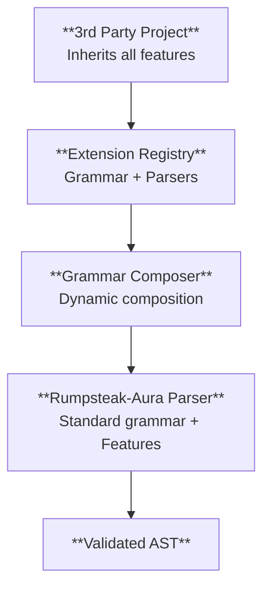

# Syntax Extensions in Rumpsteak-Aura

This guide covers the complete syntax extension system in rumpsteak-aura, which allows 3rd party projects to inherit ALL features automatically while adding their own custom extensions.

## Overview

The rumpsteak-aura extension system provides a clean way for 3rd party projects to extend choreographic DSL syntax while automatically inheriting all core features.

Core capabilities include full feature inheritance (choice constructs, loops, branch parallel, parameterized roles, protocol composition, error handling), automatic extension discovery and registration, cached grammar composition with 387x performance improvements, priority-based conflict resolution between extensions, and a preprocessing approach for simplicity and maintainability.

## Architecture

The extension system uses a preprocessing approach that provides clean separation between extension and base parsing:



Key benefits include clean separation between extension and base parsing, cached transformations with minimal overhead (387x faster when cached), no complex runtime grammar composition, and compatibility with the current DSL without requiring legacy syntax.

## Complete Integration Example

The `external-demo` project demonstrates the proper way for 3rd party projects to integrate with rumpsteak-aura. It uses a two-crate architecture:
- `external-demo` - Regular crate that re-exports ALL rumpsteak-aura functionality 
- `external-demo-macros` - Proc-macro crate providing full-featured choreography! macro

Here's the complete implementation:

### 1. Project Setup

Two-crate architecture for maximum compatibility:

`external-demo/Cargo.toml` (Regular crate):
```toml
[dependencies]
# Re-export all rumpsteak-aura functionality  
rumpsteak-aura = { path = ".." }
rumpsteak-aura-choreography = { path = "../choreography" }
# Import custom proc macros
external-demo-macros = { path = "../external-demo-macros" }
```

This dependency set re-exports the core crates and the custom macro crate. It keeps the consumer crate in sync with the base APIs.

`external-demo-macros/Cargo.toml` (Proc-macro crate):
```toml
[lib]
proc-macro = true

[dependencies]
rumpsteak-aura-choreography = { path = "../choreography" }
proc-macro2 = "1.0"  
quote = "1.0"
syn = { version = "2.0", features = ["full"] }
```

This declares a proc-macro crate that depends on the choreography crate. It also pulls in the standard macro tooling dependencies.

### 2. Re-export Pattern (external-demo)

```rust
// external-demo/src/lib.rs
// Re-export ALL rumpsteak-aura functionality so 3rd parties get everything
pub use rumpsteak_aura::*;
pub use rumpsteak_aura_choreography::*;

// Import our custom proc macros from the separate proc-macro crate
pub use external_demo_macros::*;

// Extension definitions for Aura  
pub mod aura_extensions;

/// Full-featured choreography! macro with ALL rumpsteak-aura features
pub use external_demo_macros::choreography;
```

This re-exports the base APIs and the custom macro entry point. It ensures downstream crates see the same surface as rumpsteak-aura.

### 3. Extension Definition

```rust
// external-demo/src/aura_extensions.rs
use rumpsteak_aura_choreography::extensions::*;

#[derive(Debug)]
pub struct AuraGrammarExtension;

impl GrammarExtension for AuraGrammarExtension {
    fn grammar_rules(&self) -> &'static str {
        r#"
        timeout_stmt = { "timeout" ~ integer ~ block }
        "#
    }

    fn statement_rules(&self) -> Vec<&'static str> {
        vec!["timeout_stmt"]
    }

    fn extension_id(&self) -> &'static str {
        "aura_extensions"
    }

    fn priority(&self) -> u32 {
        100
    }
}

pub fn register_aura_extensions(registry: &mut ExtensionRegistry) {
    let _ = registry.register_grammar(AuraGrammarExtension);
}
```

This defines a grammar extension and registers it in the extension registry. The rule name and priority control how it composes.

### 4. Proc-Macro Implementation (external-demo-macros)

```rust
// external-demo-macros/src/choreography.rs
use rumpsteak_aura_choreography::{
    ast::Choreography,
    compiler::parser::parse_choreography_str,
};

/// Full-featured choreography macro that inherits ALL rumpsteak-aura features
pub fn choreography_impl(input: TokenStream) -> Result<TokenStream, syn::Error> {
    let input_str = input.to_string();
    let registry = ExtensionRegistry::new(); // Empty registry for stable generation
    
    match parse_and_generate_with_extensions(&input_str, &registry) {
        Ok(tokens) => Ok(tokens),
        Err(err) => {
            let error_msg = err.to_string();
            Err(syn::Error::new(
                proc_macro2::Span::call_site(),
                format!("Choreography compilation error: {}", error_msg),
            ))
        }
    }
}

// lib.rs exports the proc macro
#[proc_macro]
pub fn choreography(input: TokenStream) -> TokenStream {
    match choreography::choreography_impl(input.into()) {
        Ok(output) => output.into(),
        Err(err) => err.to_compile_error().into(),
    }
}
```

This macro implementation delegates to the extension-aware parser and code generator. It forwards errors as compile errors.

### 4. Dynamic Role Generation

```rust
/// Generate code for an Aura choreography with integrated effect system
fn generate_aura_choreography_code(choreography: &Choreography) -> TokenStream {
    // Extract namespace from the module header (if present)
    let namespace = choreography.namespace.as_deref().unwrap_or("aura_choreography");
    let choreo_name = syn::Ident::new(namespace, proc_macro2::Span::call_site());

    // Extract roles from choreography to generate role enum dynamically
    let role_variants: Vec<syn::Ident> = choreography
        .roles
        .iter()
        .map(|role| syn::Ident::new(&role.name.to_string(), proc_macro2::Span::call_site()))
        .collect();

    // Generate the main choreography module with dynamic roles
    quote! {
        pub mod #choreo_name {
            // Dynamically extracted roles from choreography
            #[derive(Debug, Clone, Copy, PartialEq, Eq, Hash)]
            pub enum AuraRole {
                #(#role_variants),*
            }

            impl std::fmt::Display for AuraRole {
                fn fmt(&self, f: &mut std::fmt::Formatter<'_>) -> std::fmt::Result {
                    match self {
                        #(AuraRole::#role_variants => write!(f, stringify!(#role_variants))),*
                    }
                }
            }

            // Aura effect types that work with any role configuration
            #[derive(Clone, Debug)]
            pub struct ValidateCapability {
                pub capability: String,
                pub role: AuraRole,
            }

            #[derive(Clone, Debug)]
            pub struct ChargeFlowCost {
                pub cost: u64,
                pub role: AuraRole,
            }

            pub fn create_choreography() -> Program<AuraRole, String> {
                Program::new()
            }
        }
    }
}
```

This example shows dynamic role extraction and code generation scaffolding. It builds a role enum from the parsed choreography.

## Grammar Composition System

The `GrammarComposer` provides high-performance grammar composition with caching:

### Basic Usage

```rust
use rumpsteak_aura_choreography::{GrammarComposer, GrammarExtension};

let mut composer = GrammarComposer::new();
composer.register_extension(MyExtension);

// First composition (computes and caches)
let grammar = composer.compose()?; // ~3.6ms

// Subsequent compositions (uses cache)
let grammar2 = composer.compose()?; // ~9.3μs (387x faster!)
```

This example composes a grammar and then hits the cache on the second call. It demonstrates the speedup from caching.

### Performance Optimizations

The grammar composer includes several performance optimizations:

```rust
impl GrammarComposer {
    /// Compose grammar with caching for optimal performance
    pub fn compose(&mut self) -> Result<String, GrammarCompositionError> {
        // Check cache first - provides 387x speedup
        let current_hash = self.compute_extension_hash();
        if let Some(ref cached) = self.cached_grammar {
            if current_hash == self.extension_hash {
                return Ok(cached.clone());
            }
        }
        
        // Recompute with optimizations
        let composed = self.compose_uncached()?;
        
        // Cache the result
        self.cached_grammar = Some(composed.clone());
        self.extension_hash = current_hash;
        
        Ok(composed)
    }
}
```

This shows the cached path in the composer implementation. The cache avoids recomputing the composed grammar.

Performance benefits include 387x speedup for repeated compositions through caching, pre-allocated string buffers for memory optimization, hash-based cache invalidation, and optimized string operations with reduced allocations.

## Extension Parser System

The `ExtensionParser` handles extension-aware parsing with optimizations:

```rust
use rumpsteak_aura_choreography::*;

// Create extension parser
let mut parser = ExtensionParser::new();
parser.register_extension(MyGrammarExtension, MyStatementParser);

// Parse with extensions
let choreography = parser.parse_with_extensions(choreography_text)?;
```

This example constructs an extension aware parser and parses a DSL string. It uses registered grammar and statement parsers.

### Optimized Parsing

```rust
impl ExtensionParser {
    /// Parse with extension support (optimized for performance)
    pub fn parse_with_extensions(
        &mut self,
        input: &str,
    ) -> Result<Choreography, ExtensionParseError> {
        // Reuse pre-allocated buffers to reduce allocations
        self.parse_buffer.clear();
        self.extension_cache.clear();
        
        // Reserve capacity based on input size for efficient parsing
        self.parse_buffer.reserve(input.len());

        // Use standard parser (inherits ALL features automatically)
        let mut choreography = parse_choreography_str(input)
            .map_err(ExtensionParseError::StandardParseError)?;

        // Post-process to handle extension statements
        choreography.protocol = 
            self.process_extensions_optimized(choreography.protocol, input, &choreography.roles)?;

        Ok(choreography)
    }
}
```

This example shows a custom parse pass that augments the base parser. It runs extension logic after the core parse succeeds.

## Feature Inheritance Demonstration

The system ensures 3rd party projects automatically inherit ALL rumpsteak-aura features:

### Choice Constructs

```rust
choreography!(r#"
protocol Example =
  roles Alice, Bob, Charlie
  case choose Alice of
    Path1 ->
      Alice -> Bob : Request
    Path2 ->
      Alice -> Charlie : Alternative
"#);
```

This example shows choice syntax in an extended project. The macro receives the DSL as a string literal.

### Parameterized Roles

```rust
choreography!(r#"
protocol Distributed =
  roles Worker[N], Manager, Client[3]
  Worker[*] -> Manager : Status
  Manager -> Client[0] : Response
"#);
```

This example shows parameterized roles and indexed role references. It uses the same macro entry point.

### Loop Constructs

```rust
choreography!(r#"
protocol Streaming =
  roles Producer, Consumer
  loop forever
    Producer -> Consumer : Data
"#);
```

This example shows an infinite loop in a protocol. It uses the same syntax as the base DSL.

### Protocol Composition

All advanced rumpsteak-aura features work automatically in 3rd party projects without any additional integration work.

## Extension Discovery System

The discovery system automatically finds and registers extensions:

```rust
use rumpsteak_aura_choreography::extensions::discovery::*;

// Automatic discovery
let discovery = ExtensionDiscovery::new();
let extensions = discovery.discover_extensions("./extensions")?;

// Metadata-driven registration
let metadata = ExtensionMetadata {
    name: "timeout".to_string(),
    version: semver::Version::parse("1.0.0")?,
    description: "Timeout extension for choreographic protocols".to_string(),
    dependencies: vec![], // Extension dependencies
};

let registry = ExtensionRegistry::new();
registry.register_with_metadata(TimeoutExtension, metadata)?;
```

This example discovers extensions and registers them with metadata. It shows both discovery and manual registration paths.

## Best Practices for 3rd Party Integration

### 1. Use Standard Parser for Maximum Compatibility

```rust
// ✅ GOOD: Use standard parser to inherit ALL features
let choreography = parse_choreography_str(&input)?;

// ❌ BAD: Custom parsing loses feature inheritance
let choreography = my_custom_parser(&input)?;
```

This shows the recommended parsing path. Custom parsers bypass feature inheritance.

### 2. Extract Extension Data from AST

```rust
// ✅ GOOD: Extract extension data from the parsed AST
let nodes = extract_extension_nodes(&choreography.protocol, "timeout");

// ❌ BAD: Custom parsing of extension syntax
let extensions = parse_custom_extension_syntax(&input)?;
```

This example compares AST extraction with custom parsing. The AST route preserves extension semantics.

### 3. Generate Dynamic Roles

```rust
// ✅ GOOD: Extract roles dynamically from choreography
let role_variants: Vec<_> = choreography.roles.iter()
    .map(|role| syn::Ident::new(&role.name.to_string(), span))
    .collect();

// ❌ BAD: Hardcode role names
enum Role { Alice, Bob } // Won't work with different choreographies
```

This shows dynamic role generation from the AST. It avoids hard coded role sets.

### 4. Proper Error Handling

```rust
// ✅ GOOD: Detailed error context
let choreography = match parse_choreography_str(&input) {
    Ok(result) => result,
    Err(e) => {
        let error_msg = format!("Choreography parse error: {}", e);
        return syn::Error::new(span, error_msg).to_compile_error().into();
    }
};
```

This example returns detailed parse errors. It keeps compiler diagnostics actionable.

## Testing Extension System

Comprehensive test coverage ensures extension system robustness:

### Grammar Composition Tests

```rust
#[test]
fn test_grammar_composition_performance() {
    let mut composer = GrammarComposer::new();
    composer.register_extension(TestExtension);

    // First composition
    let start = std::time::Instant::now();
    let result1 = composer.compose().unwrap();
    let first_time = start.elapsed();

    // Second composition (should use cache)
    let start = std::time::Instant::now();
    let result2 = composer.compose().unwrap();
    let second_time = start.elapsed();

    assert_eq!(result1, result2);
    // Should be significantly faster due to caching
    assert!(second_time < first_time / 10);
}
```

This test checks caching by comparing the first and second composition times. It asserts a speedup from the cached path.

### Extension Parser Tests

```rust
#[test]
fn test_extension_parsing() {
    let mut parser = ExtensionParser::new();
    parser.register_extension(TestGrammarExtension, TestStatementParser);

    let choreography = parser.parse_with_extensions(r#"
        protocol TestProtocol =
          roles Alice, Bob
          Alice -> Bob : Message
    "#).expect("Should parse with extensions");

    assert_eq!(choreography.roles.len(), 2);
    assert_eq!(choreography.roles[0].name, "Alice");
}
```

This test exercises the extension parser with a small protocol. It checks role extraction and parse success.

### Feature Inheritance Tests

```rust
#[test]
fn test_feature_inheritance() {
    // Test that 3rd party projects inherit parameterized roles
    let choreography = parse_choreography_str(r#"
        protocol Test =
          roles Worker[N], Manager
          Worker[*] -> Manager : Status
    "#).expect("Should parse parameterized roles");

    // Verify parameterized role parsing worked
    assert!(choreography.roles.iter().any(|r| r.param.is_some()));
}
```

This test validates that parameterized roles survive extension parsing. It checks that the role list includes a parameter.

## Migration Guide

### From Custom DSL to Extension System

Before (custom DSL):
```rust
// Custom macro with limited features
my_choreography!(r#"
protocol MyProtocol =
  A -> B : Message with_timeout 5000
"#);
```

This example shows a legacy custom macro. It now expects a string literal input like the standard macro.

After (extension system with full feature inheritance):
```rust
// Standard rumpsteak-aura with extensions
choreography!(r#"
protocol MyProtocol =
  roles A, B
  case choose A of
    Fast ->
      A -> B : QuickMessage
    Slow ->
      timeout 5000 { A -> B : SlowMessage }
"#);
```

This example uses the standard macro with an extension statement. It inherits all base DSL features.

### Performance Considerations

The extension system is optimized for production use. Grammar composition takes approximately 3.6ms initially and 9.3μs when cached (387x speedup). Pre-allocated buffers reduce GC pressure. Extension parsing adds minimal overhead over standard parsing.

For performance-critical applications:
- Reuse `GrammarComposer` instances to benefit from caching
- Use `ExtensionParserBuilder` pattern for consistent parser configuration
- Monitor performance with built-in metrics

## Troubleshooting

### Common Issues

Grammar conflicts require namespaced rule names and appropriate priorities. Feature loss occurs when not using `parse_choreography_str` for full feature inheritance. Performance improves when reusing composer instances for caching. Role mismatch happens when not generating roles dynamically from the choreography AST.

### Debugging Tools

```rust
// Check composed grammar
let mut composer = GrammarComposer::new();
composer.register_extension(MyExtension);
let grammar = composer.compose()?;
println!("Composed grammar:\n{}", grammar);

// Extension statistics
let parser = ExtensionParser::new();
let stats = parser.extension_stats();
println!("Extensions registered: {}", stats.grammar_extensions);
```

This snippet inspects the composed grammar and extension stats. It helps diagnose registration issues.

## Complete Example: external-demo

The `external-demo` project provides a complete working example of 3rd party integration using the two-crate pattern. It demonstrates full feature inheritance where all rumpsteak-aura features work automatically. The integration uses a simple preprocessing approach. Roles are extracted from the choreography at compile time. Extension data converts to effect system calls. The implementation leverages cached grammar composition for performance.

To see the complete implementation:
```bash
cd external-demo
cargo build --examples  # Verify compilation
cargo run --example simple_ping_pong  # Run example
cargo run --example threshold_ceremony  # Advanced features
```

This demonstrates how 3rd party projects can integrate with rumpsteak-aura while inheriting ALL features automatically and adding their own domain-specific extensions.

## Advanced Topics

### Extension Dependencies

```rust
let metadata = ExtensionMetadata {
    dependencies: vec![
        ExtensionDependency {
            name: "timeout".to_string(),
            version_req: semver::VersionReq::parse("^1.0")?,
        }
    ],
    // ...
};
```

This example declares extension dependencies in metadata. The registry checks these at registration time.

### Custom Validation

```rust
impl ProtocolExtension for MyProtocol {
    fn validate(&self, roles: &[Role]) -> Result<(), ExtensionValidationError> {
        // Custom validation logic
        if self.requires_minimum_roles > roles.len() {
            return Err(ExtensionValidationError::InvalidStructure {
                reason: format!("Requires at least {} roles", self.requires_minimum_roles),
            });
        }
        Ok(())
    }
}
```

The extension system provides a complete foundation for building domain-specific choreographic languages while maintaining full compatibility with rumpsteak-aura's features.
