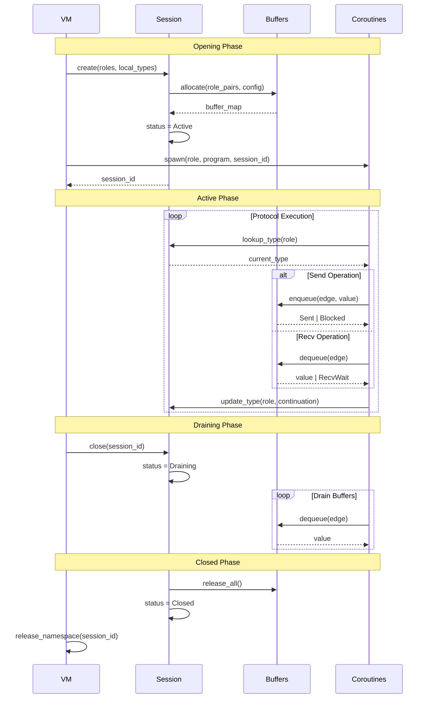

# Session Lifecycle

This document details session state management and buffer configuration.

## Session State

A session represents an active protocol instance in the VM.

```rust
pub struct SessionState {
    pub sid: SessionId,
    pub roles: Vec<String>,
    pub local_types: BTreeMap<Endpoint, TypeEntry>,
    pub buffers: BTreeMap<Edge, BoundedBuffer>,
    pub status: SessionStatus,
    pub epoch: usize,
}

pub enum SessionStatus {
    Active,
    Draining,
    Closed,
    Cancelled,
    Faulted { reason: String },
}
```

The `SessionState` struct holds the session ID, participating roles, and current status. The `buffers` map holds message queues indexed by edge. The `local_types` map tracks the current and original local type for each endpoint.

The session progresses through several statuses. Active sessions allow all operations. Draining sessions are used when closing with pending messages. Closed sessions reject all operations. Cancelled and faulted sessions capture exceptional shutdown.

## Lifecycle Overview



This diagram shows the phases of a session lifecycle. The opening phase allocates resources and spawns coroutines. The active phase executes protocol operations with type state tracking. The draining status is set when a close occurs with pending messages. The current VM does not automatically drain buffers, so higher-level logic must decide when to mark a session closed.

## Opening Sessions

Sessions are created by `VM::load_choreography`, which calls `SessionStore::open`.

Buffer allocation creates a bounded buffer for each role pair. The buffer configuration specifies capacity and mode. All buffers start empty with type state initialized from the code image.

```rust
fn open_session(
    store: &mut SessionStore,
    roles: Vec<String>,
    buffer_config: &BufferConfig,
    initial_types: &BTreeMap<String, LocalTypeR>,
) -> SessionId {
    store.open(roles, buffer_config, initial_types)
}
```

The function generates a fresh session ID, allocates buffers for each directed edge, and initializes local type state.

## Type State Management

The VM tracks the current local type for each role as the session progresses.

```rust
impl SessionStore {
    pub fn lookup_type(&self, ep: &Endpoint) -> Option<&LocalTypeR> {
        self.sessions
            .get(&ep.sid)?
            .local_types
            .get(ep)
            .map(|e| &e.current)
    }

    pub fn update_type(&mut self, ep: &Endpoint, new_type: LocalTypeR) {
        if let Some(session) = self.sessions.get_mut(&ep.sid) {
            if let Some(entry) = session.local_types.get_mut(ep) {
                entry.current = new_type;
            }
        }
    }
}
```

The `lookup_type` method retrieves the current type for an endpoint. The `update_type` method advances the type after an instruction executes.

Recursive types require unfolding before use. The VM uses `unfold_mu` and `unfold_if_var` to resolve recursion.

```rust
fn unfold_mu(lt: &LocalTypeR) -> LocalTypeR {
    match lt {
        LocalTypeR::Mu { body, .. } => unfold_mu(body),
        other => other.clone(),
    }
}

fn unfold_if_var(cont: &LocalTypeR, original: &LocalTypeR) -> LocalTypeR {
    match cont {
        LocalTypeR::Var(_) => unfold_mu(original),
        LocalTypeR::Mu { .. } => unfold_mu(cont),
        other => other.clone(),
    }
}
```

These helpers keep recursive sessions progressing by unfolding to the first active node.

## Bounded Buffers

Each buffer has a mode that controls message handling.

```rust
pub enum BufferMode {
    Fifo,
    LatestValue,
}
```

The `FIFO` mode preserves message ordering. Messages are delivered in the order they were sent. The buffer behaves as a bounded queue.

The `LatestValue` mode keeps only the most recent message. Older messages are discarded when a new message arrives. This mode suits scenarios where only current state matters.

```rust
pub struct BufferConfig {
    pub mode: BufferMode,
    pub initial_capacity: usize,
    pub policy: BackpressurePolicy,
}
```

`BoundedBuffer` is an internal ring buffer constructed from `BufferConfig`. It stores `Value` items and enforces the backpressure policy.

## Backpressure Policies

Backpressure policies determine behavior when a send would exceed buffer capacity.

```rust
pub enum BackpressurePolicy {
    Block,
    Drop,
    Error,
    Resize { max_capacity: usize },
}
```

The `Block` policy causes the sending coroutine to block until space becomes available. The `Drop` policy silently discards the message and continues. The `Error` policy causes the send instruction to fault. The `Resize` policy grows the buffer up to the maximum capacity.

```rust
fn enqueue(buffer: &mut BoundedBuffer, value: Value) -> EnqueueResult {
    buffer.enqueue(value)
}
```

The `enqueue` method applies the backpressure policy and returns `EnqueueResult` to indicate success, blocking, drop, or full buffer.

## Closing Sessions

The `Close` instruction marks a session as `Draining` when any buffer still has messages. It marks the session as `Closed` when all buffers are empty at the time of the call.

```rust
fn close_session(store: &mut SessionStore, sid: SessionId) -> Result<(), String> {
    store.close(sid)
}
```

The `SessionStore::close` method checks all buffers and updates the status. The VM does not perform automatic draining, so higher-level logic decides when to retry close or drop pending messages.
