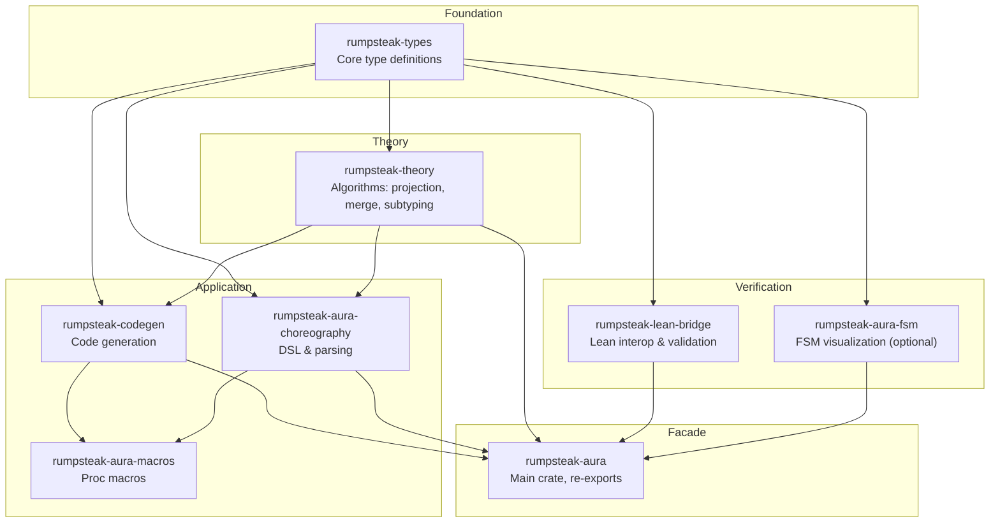

# Crate Architecture

This document describes the crate architecture introduced in v0.7.0. The structure aligns with Lean verification and provides clear separation of concerns.

## Crate Dependency Graph



This diagram shows the dependency relationships between crates. Arrows indicate dependency direction. The `rumpsteak-types` crate serves as the foundation for all other crates.

## Crate Descriptions

### rumpsteak-types

This crate is located in `rust/types/`. It contains all core type definitions that match Lean exactly. It has no dependencies on other workspace crates.

The crate defines `GlobalType` for global protocol views. It defines `LocalTypeR` for local participant views. It also defines `Label` for message labels with payload sorts, `PayloadSort` for type classification, and `Action` for send and receive actions.

```rust
use rumpsteak_types::{GlobalType, LocalTypeR, Label, PayloadSort};

let g = GlobalType::comm(
    "Client",
    "Server",
    vec![(Label::new("request"), GlobalType::End)],
);

let lt = LocalTypeR::send("Server", Label::new("request"), LocalTypeR::End);
```

The first expression creates a global type matching Lean's `GlobalType.comm "Client" "Server" [...]` constructor. The second creates a local type matching Lean's `LocalTypeR.send "Server" [...]` constructor.

### rumpsteak-theory

This crate is located in `rust/theory/`. It implements pure algorithms for session type operations. The crate performs no IO or parsing.

The `projection` module handles `GlobalType` to `LocalTypeR` projection with merging. The `merge` module implements branch merging for projection. The `subtyping/sync` module provides synchronous subtyping. The `subtyping/async` module provides asynchronous subtyping via SISO decomposition. The `well_formedness` module contains validation predicates. The `duality` module computes dual types. The `bounded` module implements bounded recursion strategies.

```rust
use rumpsteak_theory::{project, merge, sync_subtype, async_subtype};
use rumpsteak_types::GlobalType;

let global = GlobalType::comm("A", "B", vec![...]);
let local_a = project(&global, "A")?;
let local_b = project(&global, "B")?;

assert!(sync_subtype(&local_a, &local_a_expected));
```

The `project` function computes the local type for a given role. The `sync_subtype` function checks synchronous subtyping between local types.

### rumpsteak-codegen

This crate is located in `rust/codegen/`. It generates Rust code from session types. It depends on `rumpsteak-types`, `rumpsteak-theory`, `proc-macro2`, `quote`, and `syn`.

The `rust/session` module generates session types including `Send`, `Recv`, `Choose`, and `Offer`. The `rust/roles` module generates role structs. The `rust/messages` module generates message types. The `rust/runners` module generates runner functions. The `rust/typed` module generates typed runner wrappers. The `rust/effects` module generates effects-based protocols. The `rust/concurrency` module provides concurrency control utilities. The `templates/` directory contains protocol templates.

```rust
use rumpsteak_codegen::{generate_session_type, generate_all_runners};
use rumpsteak_types::LocalTypeR;

let lt = LocalTypeR::send("B", Label::new("msg"), LocalTypeR::End);
let session_tokens = generate_session_type(&lt);
```

The `generate_session_type` function produces proc-macro token streams from local types. These tokens compile to Rust session type definitions.

### rumpsteak-aura-fsm

This crate is located in `rust/fsm/`. It provides finite state machine representation for visualization. This crate is optional.

The `dot` module handles DOT format export and parsing for Graphviz. The `mermaid` module handles Mermaid diagram format export. The `petrify` module handles Petri net export. The `subtype` module provides FSM-based subtyping as an alternative to tree-based methods. The `convert` module handles `LocalTypeR` to FSM conversion and is feature-gated.

```rust
use rumpsteak_aura_fsm::{Fsm, Dot, Mermaid};

let mut fsm: Fsm<&str, &str, ()> = Fsm::new("Client");

println!("{}", Dot::new(&fsm));
println!("{}", Mermaid::new(&fsm));
```

The `Dot` and `Mermaid` types implement `Display` for format conversion. They produce text suitable for visualization tools.

### rumpsteak-lean-bridge

This crate is located in `rust/lean-bridge/`. It provides bidirectional conversion between Rust types and Lean-compatible JSON. See [Lean-Rust Bridge](14_lean_rust_bridge.md) for detailed documentation.

The `export` module converts Rust types to JSON for Lean. The `import` module converts Lean JSON back to Rust types. The `validate` module provides cross-validation between Rust and Lean.

The `lean-bridge` CLI tool is available with the `cli` feature.

```bash
lean-bridge sample --sample ping-pong --pretty
lean-bridge validate --input protocol.json --type global
lean-bridge import --input protocol.json
```

These commands generate samples, validate round-trips, and import JSON respectively.

### rumpsteak-aura-choreography

This crate is located in `rust/choreography/`. It provides DSL and parsing for choreographic programming. It depends on `rumpsteak-types` and `rumpsteak-theory`.

The `ast/` directory contains extended AST types including `Protocol`, `LocalType`, and `Role`. The `compiler/parser` module handles DSL parsing. The `compiler/projection` module handles choreography to `LocalType` projection. The `compiler/codegen` module handles Rust code generation. The `effects/` directory contains the effect system and handlers. The `extensions/` directory contains the DSL extension system. The `runtime/` directory contains platform abstraction.

### rumpsteak-aura

This crate is located in `rust/src/`. It is the main facade crate that re-exports from all other crates.

The crate supports several feature flags. The `theory` feature includes `rumpsteak-theory` algorithms. The `codegen` feature includes `rumpsteak-codegen`. The `lean-bridge` feature includes `rumpsteak-lean-bridge`. The `fsm` feature includes `rumpsteak-aura-fsm`. The `full` feature enables all features.

```rust
use rumpsteak_aura::prelude::*;
```

The prelude provides access to types, theory algorithms, and other commonly used items.

## Data Flow

```
DSL Text                 Choreography AST               GlobalType
-----------► Parser -------------------► Lower -------------------►
 "A -> B"                    (DSL)                    (rumpsteak-types)

                                |
                                | project()
                                v

                            LocalTypeR
                         (rumpsteak-types)
                                |
                +--------------++--------------+
                |               |               |
                v               v               v
            Session          Effect          JSON
            Types           Programs        (Lean)
          (codegen)        (codegen)     (lean-bridge)
                |               |               |
                v               v               v
             Runtime         Runtime         Lean
            Execution       Execution      Validation
```

The flow begins with DSL text parsed into a choreography AST. The AST is lowered to `GlobalType`. Projection computes `LocalTypeR` for each role. From local types, code generation produces session types, effect programs, or JSON for Lean.

## Lean Correspondence

The types crate mirrors Lean definitions exactly. The following table shows the correspondence.

| Lean Type | Rust Type | File |
|-----------|-----------|------|
| `GlobalType.end` | `GlobalType::End` | `rust/types/src/global.rs` |
| `GlobalType.comm p q bs` | `GlobalType::Comm { sender, receiver, branches }` | `rust/types/src/global.rs` |
| `GlobalType.rec t G` | `GlobalType::Mu { var, body }` | `rust/types/src/global.rs` |
| `GlobalType.var t` | `GlobalType::Var(String)` | `rust/types/src/global.rs` |
| `LocalTypeR.end` | `LocalTypeR::End` | `rust/types/src/local.rs` |
| `LocalTypeR.send q bs` | `LocalTypeR::Send { partner, branches }` | `rust/types/src/local.rs` |
| `LocalTypeR.recv p bs` | `LocalTypeR::Recv { partner, branches }` | `rust/types/src/local.rs` |
| `LocalTypeR.rec t T` | `LocalTypeR::Mu { var, body }` | `rust/types/src/local.rs` |
| `LocalTypeR.var t` | `LocalTypeR::Var(String)` | `rust/types/src/local.rs` |
| `PayloadSort.unit` | `PayloadSort::Unit` | `rust/types/src/global.rs` |
| `Label` | `Label { name, sort }` | `rust/types/src/global.rs` |

The Rust variant names match Lean constructor names. Field names are consistent across both implementations.

## Extension Points

The architecture supports extension at several points.

### Adding New Code Generation Targets

Implement generators in `rust/codegen/src/` that work with `LocalTypeR`.

```rust
pub fn generate_my_target(lt: &LocalTypeR) -> MyOutput {
    // implementation
}
```

The function receives a local type and produces output in the target format. Follow existing generators as examples.

### Custom Projection Strategies

Extend projection in `rust/theory/src/projection.rs`.

```rust
pub fn project_with_strategy(
    global: &GlobalType,
    role: &str,
    strategy: ProjectionStrategy,
) -> Result<LocalTypeR, ProjectionError> {
    // implementation
}
```

The strategy parameter controls projection behavior. This enables alternative projection algorithms.

### New Visualization Formats

Add formats alongside `mermaid.rs` in `rust/fsm/src/`.

```rust
pub struct MyFormat<'a, R, N, E>(&'a Fsm<R, N, E>);

impl Display for MyFormat<'_, R, N, E> {
    // implementation
}
```

The new format type wraps an FSM reference. The `Display` implementation produces the formatted output.

### Lean Integration Extensions

Extend the lean-bridge for custom validation.

```rust
impl Validator {
    pub fn my_custom_validation(
        &self,
        rust_type: &LocalTypeR,
        lean_result: &Value,
    ) -> ValidationResult {
        // implementation
    }
}
```

Custom validation methods can implement domain-specific comparison rules. See [Lean-Rust Bridge](14_lean_rust_bridge.md) for more details.
